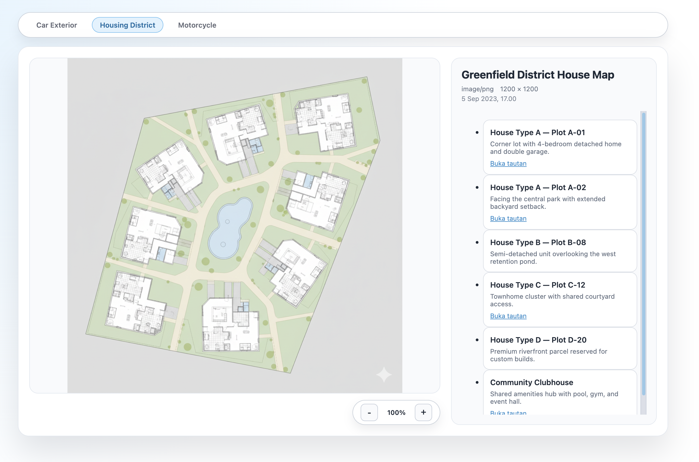

# image-annotator-js



A lightweight vanilla HTML/CSS/JS playground for exploring point-and-click image annotations. The project renders zoomable visuals, marker tooltips, and a synced sidebar powered by small JSON data files—no build tools required.

## What’s included
- **Three ready-made scenarios** &mdash; car exterior, housing district map, and motorcycle anatomy, each backed by its own `data/data*.json` file.
- **Pan & zoom canvas** &mdash; scroll to zoom, click-drag to pan, and keep markers aligned with the image.
- **Accessible markers and list** &mdash; hover or focus on markers/items to highlight details and open optional links.
- **Responsive layout** &mdash; flexible shell with light theme styling and quick scenario switcher.

## Getting started
1. Serve the folder with any static file server:
   ```bash
   npx serve .
   # or
   python3 -m http.server
   ```
2. Open the served URL (e.g. `http://localhost:8000/`).
3. Use the top switcher to jump between the three sample pages (`index.html`, `image2.html`, `image3.html`).

> ℹ️ The app fetches JSON; opening the HTML files directly from the filesystem may be blocked by your browser’s CORS rules. Always launch through a server.

## Project structure
```
├── app.js                 # Core logic: fetch data, render markers/list, pan & zoom
├── style.css              # Light theme styling and layout rules
├── data/
│   ├── data1.json         # Car exterior annotations
│   ├── data2.json         # Housing district plots & amenities
│   └── data3.json         # Motorcycle component callouts
├── images/
│   ├── image1.png         # Sample car artwork (replace with your asset)
│   ├── image2.png         # Housing district map placeholder
│   └── image3.png         # Motorcycle diagram placeholder
├── index.html             # Car exterior scenario (default)
├── image2.html            # Housing district scenario
├── image3.html            # Motorcycle scenario
└── preview.png            # Static preview used in this README
```

## Customising data
1. Duplicate one of the JSON files under `data/` or edit in place.
2. Update the `image.url`, dimensions, and metadata to match your asset.
3. Add or remove entries in the `annotations` array:
   ```json
   {
     "id": "marker-1",
     "title": "Interesting Spot",
     "description": "Quick note shown in the tooltip and list",
     "link": "https://example.com",   // optional external link
     "x": 0.42,
     "y": 0.58
   }
   ```
   Coordinates are stored as fractions (0–1) relative to the image width and height.
4. Point a page’s `data-data-url` attribute to the new file or modify the existing mapping.

## Replacing artwork
Swap any file in the `images/` directory with your own PNG while keeping the same filename (`image1.png`, `image2.png`, `image3.png`). Using matching dimensions to your JSON metadata ensures the markers stay aligned.

## License
Feel free to adapt and reuse this demo in your own projects.
